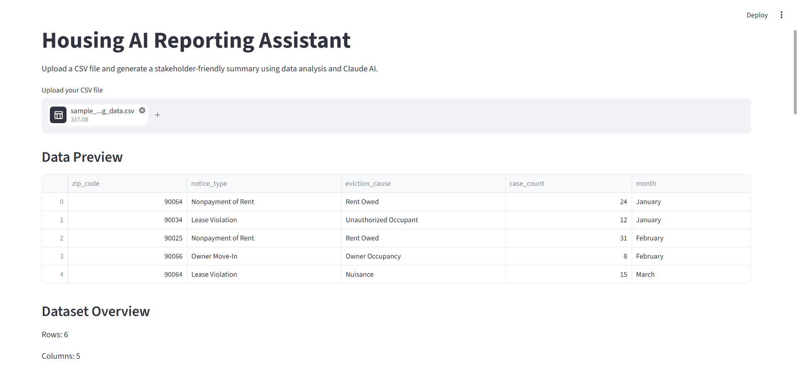
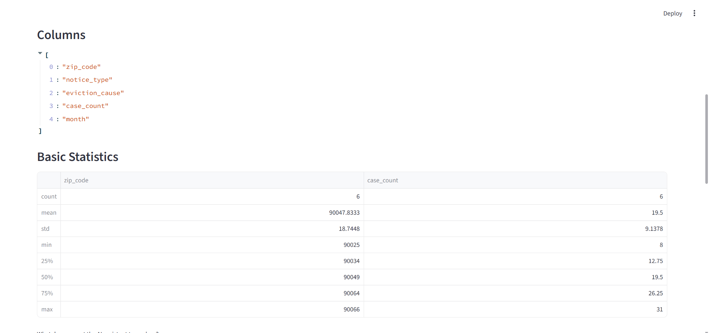

# Housing AI Reporting Assistant

An AI-powered reporting tool that transforms CSV datasets into stakeholder-friendly executive summaries for public-sector and nonprofit use cases.

---

## Project Overview

Many organizations work with valuable datasets but lack the technical resources to quickly extract actionable insights. This project demonstrates how AI can help translate structured data into plain-language summaries that are easy for non-technical stakeholders to understand.

The application allows users to upload CSV datasets, review basic statistics, and generate executive-style summaries using Claude AI.

---

## Features

* Upload CSV datasets
* Preview and inspect data
* Display dataset dimensions and column names
* Generate descriptive statistics
* Produce executive summaries with Claude AI
* Built-in fallback mode when API credits are unavailable
* Error handling and graceful degradation
* Designed for public-sector and nonprofit reporting workflows

---

## Tech Stack

* Python
* Streamlit
* Pandas
* Anthropic Claude API
* python-dotenv
* Git & GitHub

---

## Example Use Cases

* Housing departments
* Nonprofit organizations
* Civic technology projects
* Public health reporting
* Community programs
* Internal operational reporting

---

## Screenshots

### Dataset Preview



### AI Executive Summary



---

## Repository Structure

```
housing-ai-reporting-assistant/

│
├── app.py
├── requirements.txt
├── README.md
├── .env.example
├── .gitignore
│
├── sample_data/
│     └── sample_housing_data.csv
│
└── screenshots/
      ├── demo_summary1.png
      └── demo_summary2.png
```

---

## Installation

Clone the repository:

```bash
git clone https://github.com/Elliemnia/housing-ai-reporting-assistant.git
cd housing-ai-reporting-assistant
```

Create a virtual environment:

```bash
python -m venv venv
```

Activate:

```bash
.\venv\Scripts\activate
```

Install dependencies:

```bash
pip install -r requirements.txt
```

Create a .env file:

```text
ANTHROPIC_API_KEY=your_api_key_here
```

Run the application:

```bash
streamlit run app.py
```

---

## What I Learned

Through this project I practiced:

* Building AI-assisted workflows
* Integrating external APIs
* Error handling and fallback mechanisms
* Creating Streamlit applications
* Working with environment variables
* Managing projects with Git and GitHub
* Designing solutions for non-technical users

---

## Future Improvements

* Interactive visualizations
* Downloadable PDF reports
* Multi-file uploads
* Data quality validation
* Chart generation
* Support for larger datasets
* RAG-based document analysis
* Agent workflows
## Live Demo

Streamlit App:

https://housing-ai-reporting-assistant-7dwzdqv4mhws427ymbavdv.streamlit.app/

Note: This app is hosted on Streamlit Community Cloud and may take a few seconds to wake up if inactive.

GitHub Repository:

https://github.com/Elliemnia/housing-ai-reporting-assistant

---

## Project Links

* Live Demo: https://housing-ai-reporting-assistant-7dwzdqv4mhws427ymbavdv.streamlit.app/
* Source Code: https://github.com/Elliemnia/housing-ai-reporting-assistant

---

## Author

Ellie Nia

LinkedIn | GitHub | Streamlit

This project was created to demonstrate how AI can help public-sector and nonprofit organizations transform structured data into stakeholder-friendly executive summaries.
